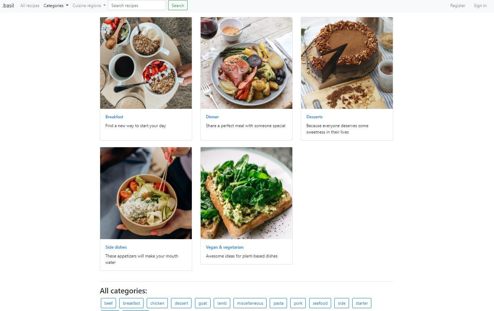
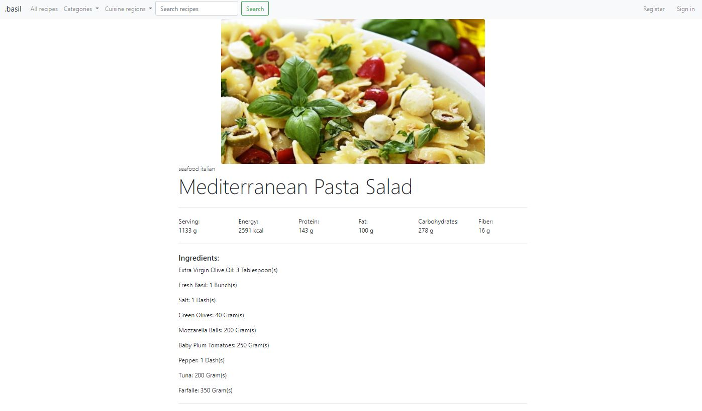

# Food and Recipes
This is a simple MVC service app that allows to search through recipe stored 
in database. Explore recipes and learn nutrient values for new dishes.

## Table of Contents
* [Introduction](#introduction)
* [Scope of Functionality](#scope-of-functionality)
* [Used Technologies](#used-technologies)
* [Setup](#setup)

# Introduction
This app was created with aim to practice developing web services using ```Java```
and ```Spring```. It allows the user to browse through newly created database, 
which contains various information about food produces, recipes and nutrients.





## Scope of Functionality
Main features of the app consists of:
* Searching recipes by name, cuisine region or category
* Given dish page has information about nutrient values, list of ingredients, step-by-step
instructions and embedded YouTube video tutorial
* Allows creating new user profiles saved in local database
* Signed-up users may add recipes to favourites


### Planned features
In further development following features are planned to be added:
* Creating custom recipes stored in database
* Verification of created recipe by admin, before displaying it in service
* Information about food allergens in recipe page

## Used Technologies
In development following technologies were used:
* Java SE 15.0.1
* Maven
* Spring Boot (Spring Data, Spring Web, Spring Security, Thymeleaf)
* MySQL
* Bootstrap 4.6.0

## Setup
In order to run the application follow these steps:
1. Clone repository ex. in Git Bash typing ```git clone https://github.com/Kamil-Kuk/food_and_recipes.git```
2. Set your MySQL user login and password in ```src/main/resources/application.properties``` 
   in fields ```spring.datasource.username``` and ```spring.datasource.password``` respectively (default root and password)
3. Run the program using IDE or using command line navigate to the root of the project and execute comman ```mvn spring-boot:run``` 
4. Type ```http://localhost:8080``` in your browser

